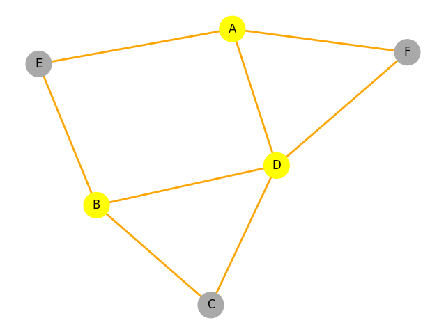

Voici le fichier README corrigé et formaté en markdown :

# Optimisation du Placement des Lampadaires

Ce projet vise à optimiser l'installation de lampadaires dans une ville modélisée par un graphe. Les places sont représentées par des nœuds, et les rues par des arêtes. L'objectif est de minimiser le nombre de lampadaires tout en éclairant toutes les rues.

## Fonctionnalités

- Création d'une ville avec :
  - Un nombre donné de places (nœuds).
  - Un nombre donné de rues (arêtes) ou une connexion complète (graphe complet).
- Placement optimisé des lampadaires en priorisant les places avec le plus de rues non éclairées.
- Visualisation graphique :
  - Nœuds orange : places avec lampadaires.
  - Arêtes jaunes : rues éclairées.
  - Arêtes noires : rues non éclairées.
- Personnalisation via arguments :
  - Nombre de places.
  - Nombre de rues ou graphe complet.

## Installation

### Prérequis

Assurez-vous d'avoir Python 3.x et les bibliothèques suivantes installées :

- numpy
- pandas
- matplotlib
- networkx

### Étapes d'installation

1. Clonez ce dépôt :

```bash
git clone https://github.com/votre-utilisateur/optimisation-lampadaires.git
cd optimisation-lampadaires
```

2. Installez les dépendances :

```bash
pip install -r requirements.txt
```

3. Lancez le programme :

```bash
python main.py <nombre_places> [--street <nombre_rues>] [--allConnected]
```

## Utilisation

### Exemples d'exécution

Ville avec 10 places et 15 rues :

```bash
python main.py 10 --street 15
```

Ville avec toutes les places connectées (graphe complet) :

```bash
python main.py 10 --allConnected
```

### Résultats

À l'exécution, le programme :
- Affiche les informations sur la ville :
  - Nombre de rues.
  - Connexions entre les places.
  - Nombre de lampadaires nécessaires.
- Dessine un graphe de la ville avec :
  - Nœuds orange : places avec lampadaires.
  - Arêtes jaunes : rues éclairées.
  - Arêtes noires : rues non éclairées.

## Structure du Projet

- `main.py` : Point d'entrée principal. Gère les arguments et affiche les résultats.
- `ville.py` : Classe Ville pour modéliser les places, rues, et lampadaires.
- `requirements.txt` : Liste des dépendances nécessaires au projet.

## Exemple de Visualisation

Voici un exemple de graphe généré :

- Nœuds orange : Places avec lampadaires.
- Arêtes jaunes : Rues éclairées.
- Arêtes noires : Rues non éclairées.



## Contributeurs

- Leroy Matéo
- www.linkedin.com/in/mateoleroy33


Citations:
[1] https://www.geeksforgeeks.org/python-visualize-graphs-generated-in-networkx-using-matplotlib/
[2] https://stackoverflow.com/questions/33227960/installing-network-x
[3] https://networkx.org/documentation/networkx-2.5/install.html
[4] https://gist.github.com/buoto/7d61b2ef8f9eb6724c8f
[5] https://networkx.org/documentation/stable/install.html
[6] https://matplotlib.org/stable/install/index.html
[7] https://pypi.org/project/networkx/2.5/
[8] https://www.youtube.com/watch?v=qA6E5UbjIsA